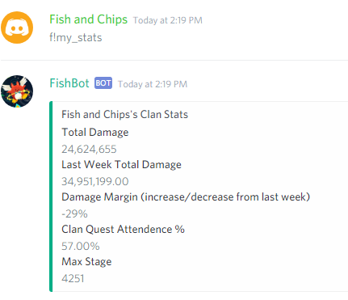

# FishBot #
A Discord Bot made for Tap Titans 2. Automatically parses google spreadsheet for statistics and has tournament timer. Works together with [FishBotScripts](https://github.com/ygongdev/FishBotScripts), a suite of scripts that updates your own database and spreadsheet from game files.

Why the name FishBot you might ask? Because it's based on my game name, Fish and Chips.

Pull requests and feedback are always welcomed!

# Table of Contents #
1. [Prerequisites](#pre)
2. [Set Up](#setUp)
3. [Node.js and Npm](#npm)
4. [Configuration](#config)
5. [Firebase](#firebase)
6. [Usage](#usage)
7. [Commands](#commands)

# Prerequisites <a name="pre"></a> #
1. You need to have an spreadsheet template that's exactly like this one: https://docs.google.com/spreadsheets/d/1SL5xFhLK9cAyjd53GJ1CYyV-GDDT3gr4Mjv0su8EpxM/edit?usp=sharing. The bot reads directly off the spreadsheet with this exact template. 
2. Obtain all the credentials needed for [Configuration](#config).
3. You can also customize the bot by directly modifying the source code, but realize that if you're planning on using FishBotScripts, you will need to modify FishBotScripts accordingly as well.

# Set Up <a name="setUp"></a> #
To get set up, you need to install the dependeicies in `package.json` and create some configuration files for your tokens, api key, and spreadsheet id.

## Node.js and Npm <a name="npm"></a> ##
1. If you don't have `node.js` nor `npm`, you need to install them first. `npm` is the package manager for node.js.
2. Now that you have `npm`. Do `npm install` to install all the needed dependecies. Most importantly, this should install `firebase` and `discord.js` for you.

## Configuration <a name="config"></a> ##
1. Create a `config` folder and the following files inside: `config.json` and `firebaseConfig.js`. 
2. `googleSpreadsheetApiKey` is obtained via Google's spreadsheet API. You have to have a google account to set up the credentials.
3. `spreadSheetId` is the id of your google spreadsheet.
4. `token` is the bot token that you obtained from creating a bot user on your discord app.
5. `prefix` is just any prefix you want the command to recognized.
6. To obtain the credentials for `firebaseConfig.js`, you need to create a firebase app first and then you can find all of your credentials.

### Example `config.json` ###
```
{
	"googleSpreadsheetApiKey": <your key>,
	"spreadSheetId": <your google spreadsheet id>,
	"token": <your bot token>,
	"prefix": <your command prefix>
}
```

### Example `firebaseConfig.js` ###
```
const firebase = require("firebase");

const config = {
	apiKey: <your key>,
	authDomain: <your domain>,
	databaseURL: <your database url>,
	projectId: <your project id>,
	storageBucket: <your url>,
	messagingSenderId: <your id>
};
firebase.initializeApp(config);

const database = firebase.database();

module.exports = {
	database: database,
}
```

## Firebase <a name="firebase"></a> ##
1. I use firebase database to keep track of the tourament rotations, so the bot knows the rewards and the type of the tournament requested.
2. There is a cron job set up in `command/tournamentCommand.js`. Since cron job doesn't take UTC time, you might have to modify it to your local time equivalent of `12:00 AM UTC Wednesday and Sunday`

### Example `Firebase Database` ###
```
{
  "tournament" : {
    "rewardCounter" : 2,
    "typeCounter" : 8
  }
}
```
# Usage <a name="usage"></a> #
To run the bot: `node bot.js`
Hosting: you can either host it locally whenever you need it or host it on a remote server, so the bot is on 24/7. For remote hosting options, I recommend Heroku(free, if this is the only application) or DigitalOcean(monthly charged).

# Commands <a name="commands"></a> #
`{prefix}weekly_stats` - displays a weekly statistics from a google spreadsheet<br>
`{prefix}curr_tour` - displays information (type, rewards, time remaining) about the current tournament if there is one.<br>
`{prefix}next_tour` - displays information (type, rewards, time remaining) about the upcoming tournament.<br>
`{prefix}my_stats` - displays your stats.<br>
`{prefix}top_damage [number]` - displays the top `number` damage dealers in clan quests.

<br>
<br>
<br>
<br>

