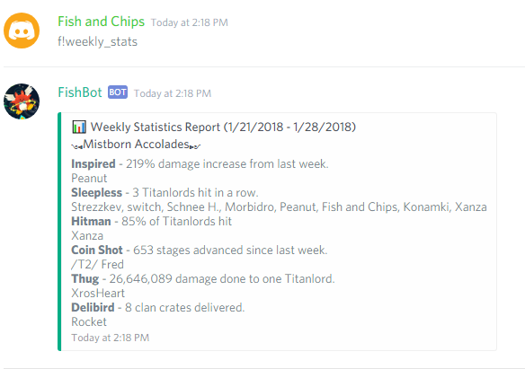

# FishBot #
A Discord Bot made for Tap Titans 2. Automatically parses google spreadsheet for statistics and has tournament timer.

# Table of Contents
1. [Set Up](#setUp)
2. [Node.js and Npm](#npm)
3. [Configuration](#config)
4. [Firebase](#firebase)
5. [Usage](#usage)
6. [Commands](#commands)

# Set Up <a name="setUp"></a> #
To get set up, you need to install the dependeicies in `package.json` and create some configuration files for your tokens, api key, and spreadsheet id.

## Node.js and Npm <a name="npm"></a> ##
1. If you don't have `node.js` nor `npm`, you need to install them first. `npm` is the package manager for node.js.
2. Now that you have `npm`. Do `npm install` to install all the needed dependecies. Most importantly, this should install `firebase` and `discord.js` for you.

## Configuration <a name="config"></a> ##
1. Create a `config` folder and the following files inside: `config.json` and `firebaseConfig.js`. 
2. `googleSpreadsheetApiKey` is obtained via Google's spreadsheet API. You have to have a google account to set up the credentials.
3. `spreadSheetId` is the id of your google spreadsheet.
4. `token` is the bot token that you obtained from creating a bot user on your discord app.
5. `prefix` is just any prefix you want the command to recognized.
6. To obtain the credentials for `firebaseConfig.js`, you need to create a firebase app first and then you can find all of your credentials.

### Example `config.json` ###
```
{
	"googleSpreadsheetApiKey": <your key>,
	"spreadSheetId": <your google spreadsheet id>,
	"token": <your bot token>,
	"prefix": <your command prefix>
}
```

### Example `firebaseConfig.js` ###
```
const firebase = require("firebase");

const config = {
	apiKey: <your key>,
	authDomain: <your domain>,
	databaseURL: <your database url>,
	projectId: <your project id>,
	storageBucket: <your url>,
	messagingSenderId: <your id>
};
firebase.initializeApp(config);

const database = firebase.database();

module.exports = {
	database: database,
}
```

## Firebase <a name="firebase"></a> ##
1. I use firebase database to keep track of the tourament rotations, so the bot knows the rewards and the type of the tournament requested.
2. There is a cron job set up in `command/tournamentCommand.js`. Since cron job doesn't take UTC time, you might have to modify it to your local time equivalent of `12:00 AM UTC Wednesday and Sunday`

### Example `Firebase Database` ###
```
{
  "tournament" : {
    "rewardCounter" : 2,
    "typeCounter" : 8
  }
}
```
# Usage <a name="usage"></a> #
Simple one liner: `node bot.js`

# Commands <a name="commands"></a> #
`{prefix}weekly_stats` - displays a weekly statistics from a google spreadsheet<br>
`{prefix}curr_tour` - displays information (type, rewards, time remaining) about the current tournament if there is one.<br>
`{prefix}next_tour` - displays information (type, rewards, time remaining) about the upcoming tournament.
`{prefix}my_stats` - displays your stats.
`{prefix}top_damage [number]` - displays the top `number` damage dealers in clan quests.

<br>
<br>
<br>
<br>

